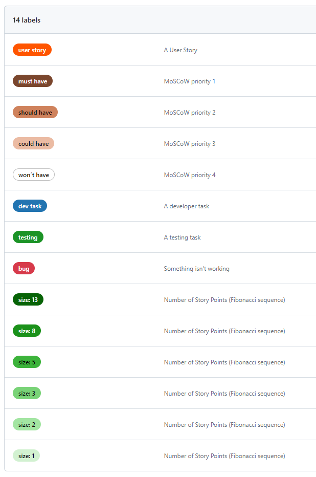
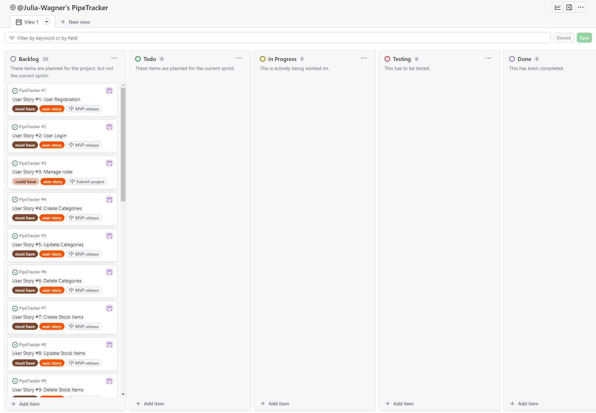

# **Agile Process**

## **Table of Contents**

<!-- TOC -->
* [**Agile Process**](#agile-process)
  * [**Table of Contents**](#table-of-contents)
  * [**Methodology**](#methodology)
<!-- TOC -->

## **Methodology**
I used an agile approach to plan and work on my project. I looked at different agile tools that I am familiar with, like *Jira* and *ClickUp*. However, I decided to use a [GitHub Projects Board](https://github.com/users/Julia-Wagner/projects/2) as it seems to be the most commonly used by Code Institute students and I imagined it to be the easiest tool to evaluate.

I decided to group my features into **Epics** and create several **User Stories** for each epic. To prioritize the stories, I used **MoSCoW Prioritization**. To represent this in my Kanban board I created custom labels (*must have*, *should have*, *could have* and *won´t have*).

To have a better overview of issues on my board, I also created custom labels for the type of issue and for Story Points using the Fibonacci sequence.

I added all my user stories with the according epic, acceptance criteria and tasks in the description. I used **milestones** from the beginning to plan a MVP release and a final submission. I decided to start by putting all my user stories in the **Backlog** column of my board. To visualize my sprints, I will use milestones. At the beginning of each sprint, I will add the according issues to the current sprint milestone and move them to the **Todo** column.

