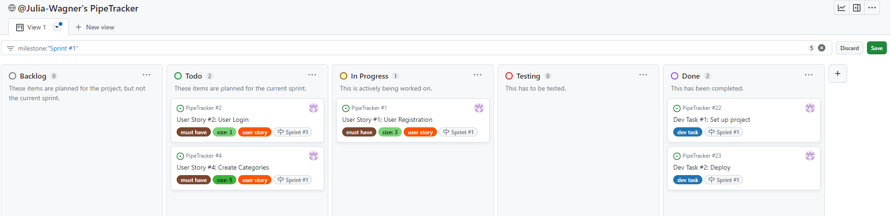
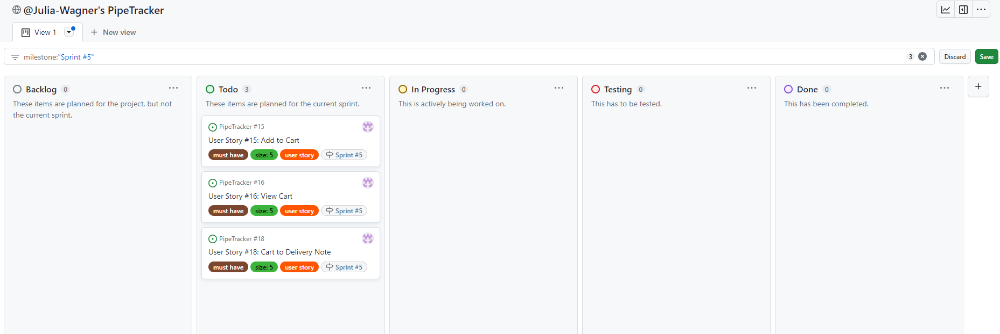

# **Agile Process**

[Go back to the README](README.md)

## **Table of Contents**

<!-- TOC -->
* [**Agile Process**](#agile-process)
  * [**Table of Contents**](#table-of-contents)
  * [**Methodology**](#methodology)
  * [**Sprints**](#sprints)
    * [**Sprint 1 (05.12. - 11.12.)**](#sprint-1-0512---1112)
    * [**Sprint 2 (12.12. - 18.12.)**](#sprint-2-1212---1812)
    * [**Sprint 3 (19.12. - 25.12.)**](#sprint-3-1912---2512)
    * [**Sprint 4 (26.12. - 01.01.2024)**](#sprint-4-2612---01012024)
    * [**Sprint 5 (02.01. - 08.01.)**](#sprint-5-0201---0801)
    * [**Sprint 6 (09.01. - 15.01.)**](#sprint-6-0901---1501)
    * [**Sprint 7 (16.01. - 22.01.)**](#sprint-7-1601---2201)
    * [**Sprint 8 (23.01. - 29.01.)**](#sprint-8-2301---2901)
<!-- TOC -->

## **Methodology**

I used an agile approach to plan and work on my project. I looked at different agile tools that I am familiar with, like *Jira* and *ClickUp*. However, I decided to use a [GitHub Projects Board](https://github.com/users/Julia-Wagner/projects/2) as it seems to be the most commonly used by Code Institute students and I imagined it to be the easiest tool to evaluate.

I decided to group my features into **Epics** and create several **User Stories** for each epic. To prioritize the stories, I used **MoSCoW Prioritization**. To represent this in my Kanban board I created custom labels (*must have*, *should have*, *could have* and *won´t have*).

To have a better overview of issues on my board, I also created custom labels for the type of issue and for Story Points using the Fibonacci sequence.

\
*My custom labels*

I added all my user stories with the according epic, acceptance criteria and tasks in the description. I used **milestones** from the beginning to plan a MVP release and a final submission. I decided to start by putting all my user stories in the **Backlog** column of my board. To visualize my sprints, I will use milestones. At the beginning of each sprint, I will add the according issues to the current sprint milestone and move them to the **Todo** column.

\
*The initial setup of my Kanban board with all User Stories in the Backlog*

## **Sprints**

Below is a summary of each of my sprints. As described above, I am using milestones for sprints. To focus on the tasks of my current sprint, I am using a filter for the current milestone to only see the issues added to my current sprint.

### **Sprint 1 (05.12. - 11.12.)**

For my first sprint, I added two dev tasks, to set up and deploy the project. Additionally, I added user stories with a total of **11 story points**.

\
*Start of Sprint 1*

I did not manage to finish all the tasks planned for my first sprint. This was mostly due to changes in the ElephantSQL free plan. I spent a lot of time looking for alternatives. Eventually, the free plan is back now and I did end up using ElephantSQL anyway.

\
*End of Sprint 1*

I will move the unfinished tasks back to the backlog and continue working on them in my next sprint.

### **Sprint 2 (12.12. - 18.12.)**

For my next sprint, I added one dev task, to add templates for the header and footer. Additionally, I added user stories with a total of **11 story points**.

\
*Start of Sprint 2*

My second sprint was very successful. After getting the general setup and authorization done, it was nice to see the progress in the application. In addition to the planned user stories, I managed to add and finish two more stories and have full CRUD functionality for my categories. I also added and fixed a bug that I encountered during the sprint while testing the application on my phone. In total, I finished user stories with **16 story points** this week.

\
*End of Sprint 2*

### **Sprint 3 (19.12. - 25.12.)**

For my third sprint, I want to concentrate on CRUD functionality for stock items. I added user stories with a total of **13 story points**.

\
*Start of Sprint 3*

Because this sprint ended with the holidays, I tried to stick to thinking about the MVP and focused on getting the full CRUD for stock items. I managed to achieve this and finished all my user stories for this sprint.

\
*End of Sprint 3*

### **Sprint 4 (26.12. - 01.01.2024)**

I decided to look at delivery notes for my next sprint. I added two *must have* and one *should have* user stories with a **total of 13 story points**.

\
*Start of Sprint 4*

I finished all planned user stories and added one more from the backlog to complete full CRUD for delivery notes.

\
*End of Sprint 4*

### **Sprint 5 (02.01. - 08.01.)**

The goal for sprint number 5 is to finish all user stories necessary for the MVP. I added user stories with a total of **15 story points**.

\
*Start of Sprint 5*

I finished all planned user stories and added one *could have* story from the backlog. I reached my goal for this sprint by completing all user stories that are necessary for the MVP.

\
*End of Sprint 5*

### **Sprint 6 (09.01. - 15.01.)**

After completing the features for the MVP in the last sprint, I want to start this sprint with an intense testing phase. I want to identify bugs and issues in the application and let my customer test the application to give me feedback for further implementation.

Additionally, I added two user stories for this sprint with a total of **13 story points**.

\
*Start of Sprint 6*

While testing the application thoroughly, I added **Bug** and **Testing** issues to my Kanban board and added them to this sprint. I managed to fix all found bugs and finish the planned user stories.

\
*End of Sprint 6*

### **Sprint 7 (16.01. - 22.01.)**

For this sprint, I only added one user story, which I gave **13 story points**. It is a feature that I am not sure if it is possible, so I will probably spend a lot of time trying different ways of doing it.

\
*Start of Sprint 7*

During this sprint, I did a lot of research and came to the conclusion, that the user story is not implementable the way I planned it. The file format I wanted to use was created specifically for German plumbing retailers. To create and use such files, a paid tool is needed.

So I decided to rewrite my user story and instead upload CSV files to automatically create stock items. I finished my user story and added and implemented another **Dev Task**, to add a search bar for stock items.

\
*End of Sprint 7*

### **Sprint 8 (23.01. - 29.01.)**

For this sprint, I added one user story with **8 story points**. Additionally, I added **Testing Tasks**, as this will be my last sprint if everything goes as planned.

\
*Start of Sprint 8*