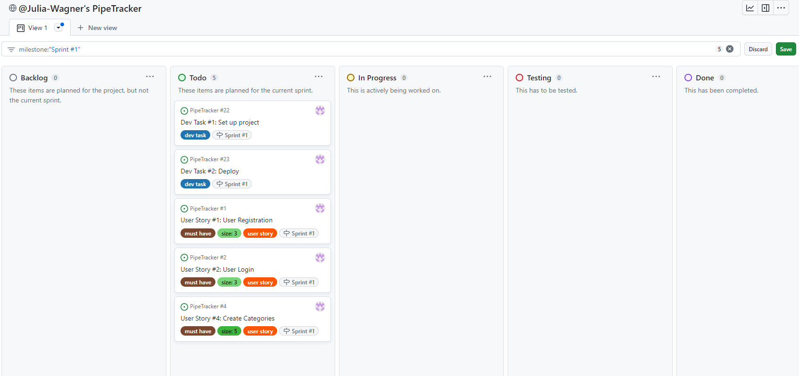

# **Agile Process**

## **Table of Contents**

<!-- TOC -->
* [**Agile Process**](#agile-process)
  * [**Table of Contents**](#table-of-contents)
  * [**Methodology**](#methodology)
  * [**Sprints**](#sprints)
    * [**Sprint 1 (05.12. - 11.12.)**](#sprint-1-0512---1112)
    * [**Sprint 2 (12.12. - 18.12.)**](#sprint-2-1212---1812)
<!-- TOC -->

## **Methodology**
I used an agile approach to plan and work on my project. I looked at different agile tools that I am familiar with, like *Jira* and *ClickUp*. However, I decided to use a [GitHub Projects Board](https://github.com/users/Julia-Wagner/projects/2) as it seems to be the most commonly used by Code Institute students and I imagined it to be the easiest tool to evaluate.

I decided to group my features into **Epics** and create several **User Stories** for each epic. To prioritize the stories, I used **MoSCoW Prioritization**. To represent this in my Kanban board I created custom labels (*must have*, *should have*, *could have* and *won´t have*).

To have a better overview of issues on my board, I also created custom labels for the type of issue and for Story Points using the Fibonacci sequence.

*My custom labels*

I added all my user stories with the according epic, acceptance criteria and tasks in the description. I used **milestones** from the beginning to plan a MVP release and a final submission. I decided to start by putting all my user stories in the **Backlog** column of my board. To visualize my sprints, I will use milestones. At the beginning of each sprint, I will add the according issues to the current sprint milestone and move them to the **Todo** column.

*The initial setup of my Kanban board with all User Stories in the Backlog*

## **Sprints**
Below is a summary of each of my sprints. As described above, I am using milestones for sprints. To focus on the tasks of my current sprint, I am using a filter for the current milestone to only see the issues added to my current sprint.

### **Sprint 1 (05.12. - 11.12.)**
For my first sprint, I added two dev tasks, to set up and deploy the project. Additionally, I added user stories with a total of **11 story points**.

*Start of Sprint 1*

I did not manage to finish all the tasks planned for my first sprint. This was mostly due to changes in the ElephantSQL free plan. I spent a lot of time looking for alternatives. Eventually, the free plan is back now and I did end up using ElephantSQL anyway.

*End of Sprint 1*

I will move the unfinished tasks back to the backlog and continue working on them in my next sprint.

### **Sprint 2 (12.12. - 18.12.)**
For my next sprint, I added one dev task, to add templates for the header and footer. Additionally, I added user stories with a total of **11 story points**.

*Start of Sprint 2*

My second sprint was very successful. After getting the general setup and authorization done, it was nice to see the progress in the application. In addition to the planned user stories, I managed to add and finish two more stories and have full CRUD functionality for my categories. I also added and fixed a bug that I encountered during the sprint while testing the application on my phone. In total, I finished user stories with **16 story points** this week.

*End of Sprint 2*

### **Sprint 3 (19.12. - 25.12.)**
For my third sprint, I want to concentrate on CRUD functionality for stock items. I added user stories with a total of **13 story points**.

*Start of Sprint 3*

Because this sprint ended with the holidays, I tried to stick to thinking about the MVP and focused on getting the full CRUD for stock items. I managed to achieve this and finished all my user stories for this sprint.

*End of Sprint 3*

### **Sprint 4 (26.12. - 01.01.)**
I decided to look at delivery notes for my next sprint. I added two *must have* and one *should have* user stories with a **total of 13 story points**.

*Start of Sprint 4*
