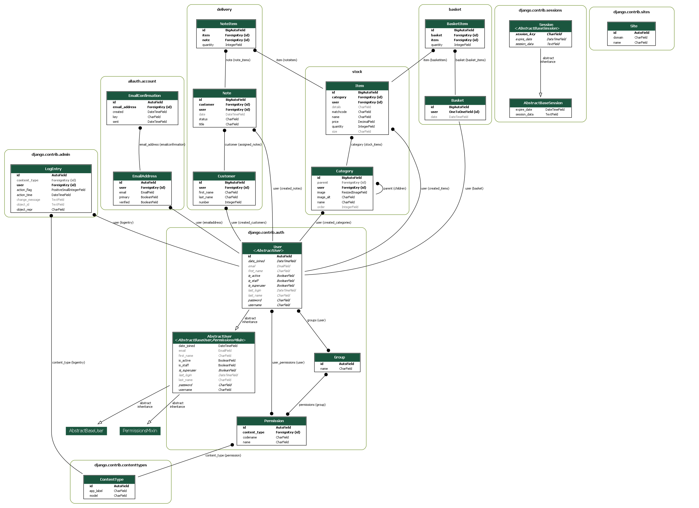
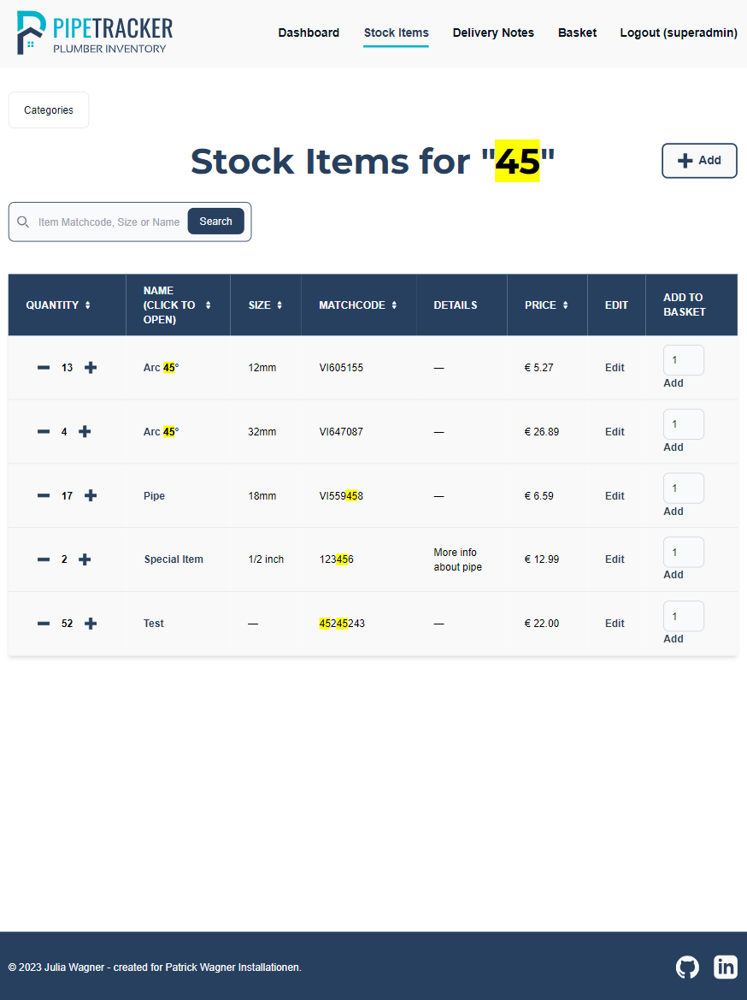
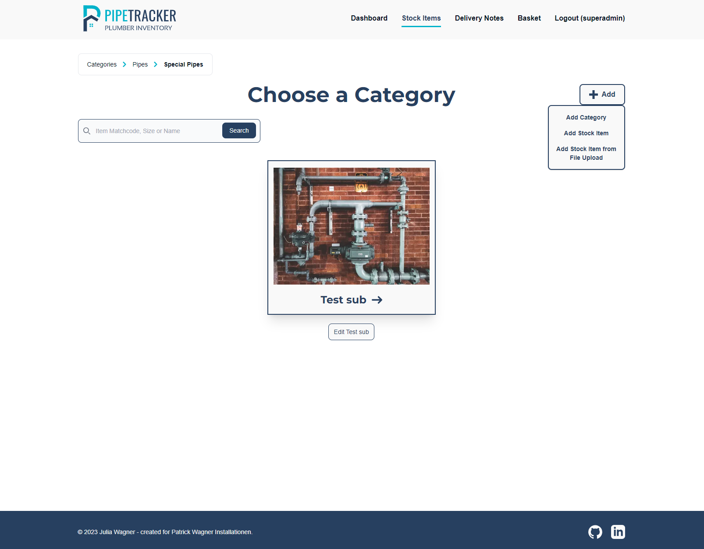
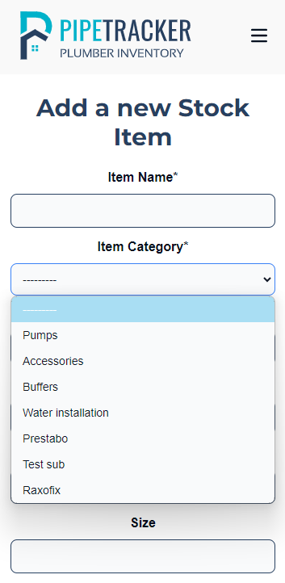
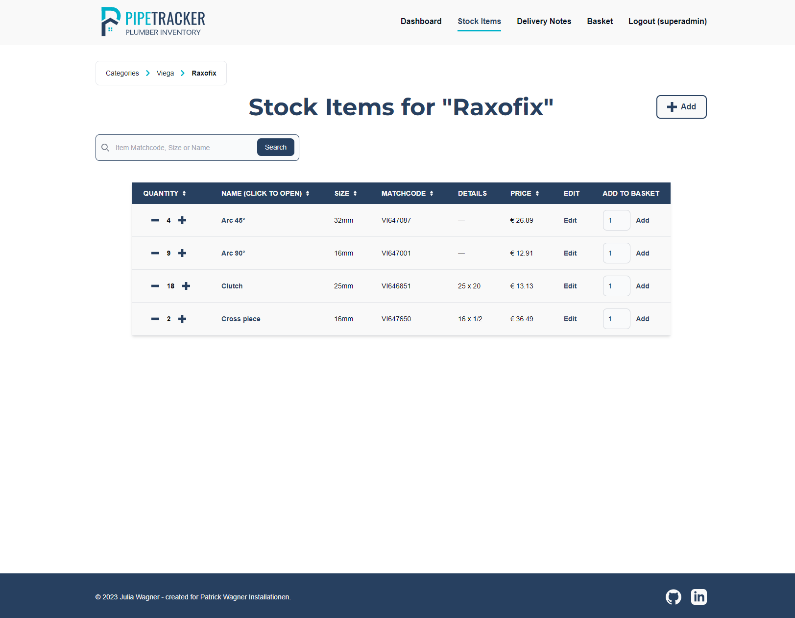
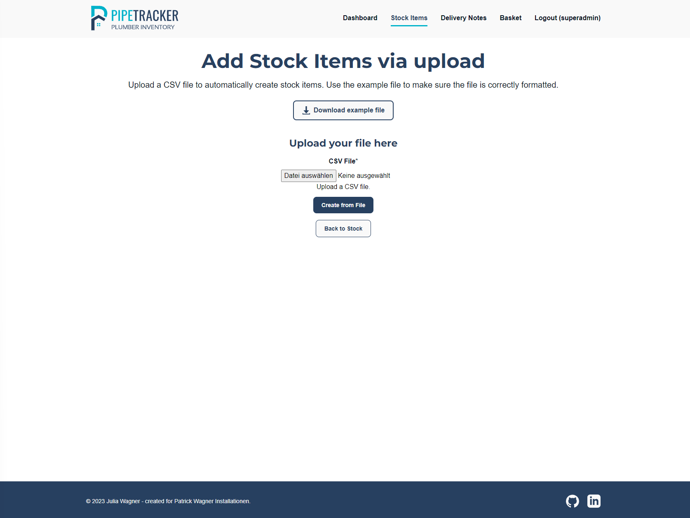
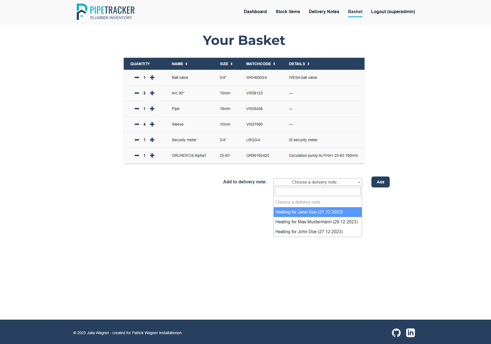
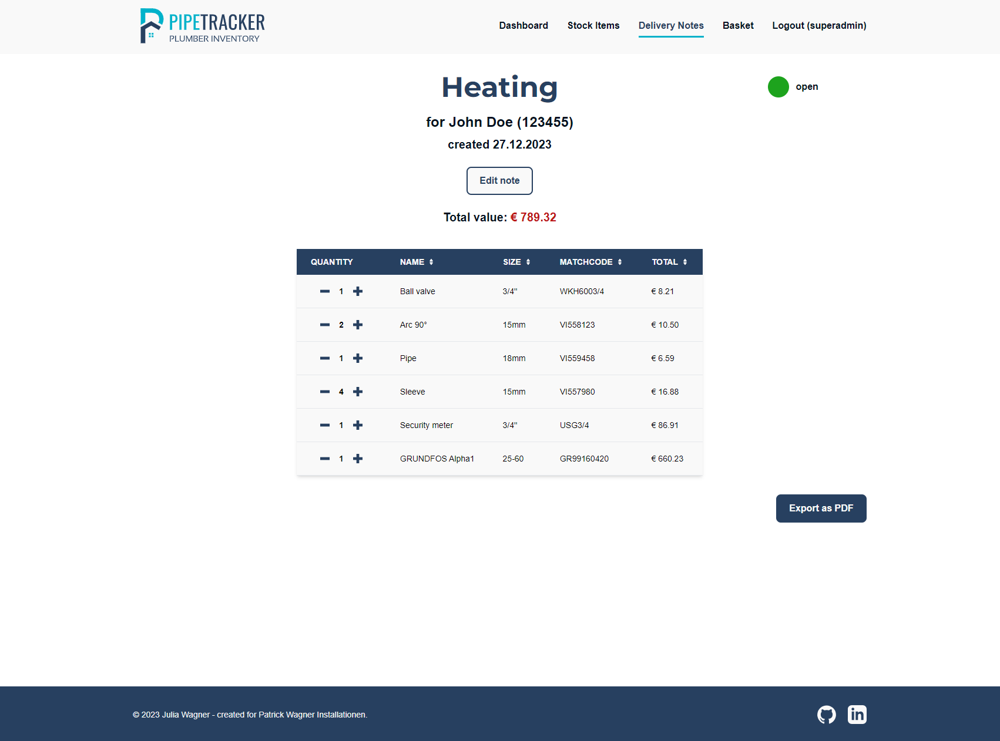

# **PipeTracker**

PipeTracker is an inventory management application specifically designed for plumbers. The project was born out of the real-world challenges of a self-employed plumber. Built with a user-centered approach, PipeTracker manages inventory for plumbing businesses and simplifies the invoicing process for plumbers.

Here is the [link to the deployed project](https://pipetracker-96d1f7c7a4dc.herokuapp.com/).

\
*Am I Responsive Screenshot*

## **Introduction**

I am aware that the application is quite extensive and might seem complicated to use. This is due to the fact that it was created as a real-world application for a real customer. It is not designed to be used by just anyone, but by plumbers and employees of plumbing businesses.

The application is shared by all users, so everyone can see, edit and delete all the stock items and delivery notes, only the basket is personal.

In a real-world scenario, new users of the application would be trained to use the application. To facilitate working with the application, I added an introduction to the most important features to the dashboard. This way new users can get an overview of the application.


*Introduction for new users*

# **Table of Contents**

<!-- TOC -->
* [**PipeTracker**](#pipetracker)
  * [**Introduction**](#introduction)
* [**Table of Contents**](#table-of-contents)
* [**Planning**](#planning)
  * [**Strategy Plane**](#strategy-plane)
    * [**Target Audience**](#target-audience)
    * [**Site Goals**](#site-goals)
  * [**Scope Plane**](#scope-plane)
    * [**Necessary Features:**](#necessary-features)
    * [**Nice-to-have Features:**](#nice-to-have-features)
  * [**Structure Plane**](#structure-plane)
    * [**Epic: User Authentication**](#epic-user-authentication)
    * [**Epic: Stock Items**](#epic-stock-items)
    * [**Epic: Statistics**](#epic-statistics)
    * [**Epic: Delivery Notes**](#epic-delivery-notes)
    * [**Epic: Cart**](#epic-cart)
    * [**Epic: Export/Import**](#epic-exportimport)
  * [**Skeleton Plane**](#skeleton-plane)
    * [**Wireframes**](#wireframes)
    * [**Database Schema**](#database-schema)
  * [**Surface Plane**](#surface-plane)
    * [**Design**](#design)
    * [**Colors and Fonts**](#colors-and-fonts)
    * [**Logo**](#logo)
* [**Features**](#features)
  * [**CRUD**](#crud)
  * [**Landing Page**](#landing-page)
  * [**Authentication**](#authentication)
  * [**Messages**](#messages)
  * [**Custom Error Pages**](#custom-error-pages)
  * [**Stock Items and Categories**](#stock-items-and-categories)
    * [**Categories**](#categories)
    * [**Stock Items**](#stock-items)
    * [**QR Code**](#qr-code)
    * [**CSV Upload**](#csv-upload)
  * [**Basket**](#basket)
  * [**Delivery Notes**](#delivery-notes)
* [**Agile Process**](#agile-process)
* [**Security**](#security)
  * [**Authentication and Authorization**](#authentication-and-authorization)
  * [**Defensive Design**](#defensive-design)
  * [**CSRF Tokens**](#csrf-tokens)
  * [**Robust Code**](#robust-code)
* [**Testing**](#testing)
* [**Deployment**](#deployment)
  * [**Create Repository**](#create-repository)
  * [**Project Setup**](#project-setup)
  * [**Database Setup**](#database-setup)
  * [**Cloudinary Setup**](#cloudinary-setup)
  * [**File Changes**](#file-changes)
  * [**Heroku Setup**](#heroku-setup)
  * [**Final Changes**](#final-changes)
  * [**Forking**](#forking)
* [**Technologies, Libraries and Frameworks**](#technologies-libraries-and-frameworks)
  * [**Tailwind**](#tailwind)
  * [**Packages**](#packages)
* [**Credits**](#credits)
  * [**Content**](#content)
  * [**Media and Design**](#media-and-design)
<!-- TOC -->

# **Planning**

I structured my planning phase using the 5 UX planes - strategy, scope, structure, skeleton, and surface. The planning process was iterative. While gaining a better understanding of the project's scope and discussing my customer's needs for the application, these planes evolved, creating a user-centered design for PipeTracker.

## **Strategy Plane**

My initial idea for this project was to create an application for my husband´s plumbing business. He is self-employed and I created his Logo, Designs and Website. So I wanted to make a real-world application where I could put this to use.

After talking to him about possible applications he might need that would be suitable for this project, the idea of an inventory tool - **PipeTracker** - quickly came to life. In the following parts of the readme, I will refer to my husband as my customer, as the application is built with his real-world needs in mind.

### **Target Audience**

As this project is intended to be a specific real-world application for my husband, he and possible employees are my target audience or customers. But in general, a tool like this could be used for all plumbing companies so a few characteristics for my target audience would be the following.

- A plumbing company that wants to keep track of its inventory with an online application.
- Anybody who wants to manage stock items and have an overview of the current value they have in stock.
- A plumber who wants to easily create a delivery note from the stock items used for a customer. 

### **Site Goals**

- Create an easy-to-use inventory tool.
- Adapt the application specifically for plumbing businesses.
- Simplify the invoicing process for plumbers.
- Give an overview of items in stock.
- Implement CRUD functionalities for stock items, delivery notes and categories.
- Make the application responsive, so it can be used on desktop, tablet and mobile screen sizes.
- Allow easy adaption to create a scalable application that could be used for other (plumbing) businesses too.

## **Scope Plane**

To get a better understanding of what the application will look like I wrote down the features and sorted them into necessary and nice-to-have features.

### **Necessary Features:**

- Plumber can log in to the application.
- Plumber can register to the application.
- Stock items can be added, updated and deleted.
- Stock items are linked to categories.
- Plumber has an overview of the current value (in €) that is in the inventory.

### **Nice-to-have Features:**

- Create a delivery note - remove items from stock by adding them to a delivery note for a customer.
- Employees can log in but have another role with different permissions (for example they don´t see the price).
- Images can be uploaded for categories.
- Plumber can make a list of items to order that can be exported as a CSV/PDF file.
- Items can be added by scanning a QR code.
- Datanorm (file format for stock items used by plumbing wholesalers) can be imported and automatically update the price for stock items.

## **Structure Plane**

From the features defined above I was able to create epics and break these down into user stories.

### **Epic: User Authentication**

| User Story                                                                                                           | Priority       |
|----------------------------------------------------------------------------------------------------------------------|----------------|
| As a **new user**, I want to **register to the application**, so that I can **manage my inventory**.                 | **MUST HAVE**  |
| As an **existing user**, I want to **log in to the application**, so that I can **access my inventory**.             | **MUST HAVE**  |
| As a **site owner**, I want to **manage user roles**, so that I can **choose who can access sensitive information**. | **COULD HAVE** |

### **Epic: Stock Items**

| User Story                                                                                                            | Priority        |
|-----------------------------------------------------------------------------------------------------------------------|-----------------|
| As a **site user**, I want to **create and view categories**, so that I can **organize my inventory**.                | **MUST HAVE**   |
| As a **site user**, I want to **update categories**, so that I can **change the structure of my inventory**.          | **MUST HAVE**   |
| As a **site user**, I want to **delete categories**, so that I can **remove unnecessary categories**.                 | **MUST HAVE**   |
| As a **site user**, I want to **create and view stock items**, so that I can **organize my inventory**.               | **MUST HAVE**   |
| As a **site user**, I want to **update stock items**, so that I can **correctly maintain my inventory**.              | **MUST HAVE**   |
| As a **site user**, I want to **delete stock items**, so that I can **remove items from my inventory**.               | **MUST HAVE**   |

### **Epic: Statistics**

| User Story                                                                                                            | Priority        |
|-----------------------------------------------------------------------------------------------------------------------|-----------------|
| As a **site user**, I want to **have a dashboard with statistics**, so that I can **make decisions for my business**. | **SHOULD HAVE** |

### **Epic: Delivery Notes**

| User Story                                                                                                                            | Priority        |
|---------------------------------------------------------------------------------------------------------------------------------------|-----------------|
| As a **site user**, I want to **create and view delivery notes**, so that I can **track where my stock items went**.                  | **MUST HAVE**   |
| As a **site user**, I want to **link customers to delivery notes**, so that I can **easily invoice the needed items for a customer**. | **SHOULD HAVE** |
| As a **site user**, I want to **update delivery notes**, so that I can **track if it was already invoiced**.                          | **MUST HAVE**   |
| As a **site user**, I want to **delete delivery notes**, so that I can **remove unnecessary delivery notes**.                         | **COULD HAVE**  |

### **Epic: Cart**

| User Story                                                                                                              | Priority       |
|-------------------------------------------------------------------------------------------------------------------------|----------------|
| As a **site user**, I want to **add stock items to the cart**, so that I can **collect the items I need**.              | **MUST HAVE**  |
| As a **site user**, I want to **view my cart**, so that I can **see my collected items**.                               | **MUST HAVE**  |
| As a **site user**, I want to **update my cart**, so that I can **change the number of added stock items**.             | **COULD HAVE** |
| As a **site user**, I want to **transfer my cart to a delivery note**, so that I can **easily fill my delivery notes**. | **MUST HAVE**  |

As described in the [features section](#basket), I decided to rename *Cart* to **Basket**. Apart from this name change, the user stories were implemented as planned.

### **Epic: Export/Import**

| User Story                                                                                                                                                            | Priority           |
|-----------------------------------------------------------------------------------------------------------------------------------------------------------------------|--------------------|
| As a **site user**, I want to **export a delivery note with its items**, so that I can **easily create an invoice for the customer**.                                 | **SHOULD HAVE**    |
| As a **site user**, I want to **update stock items by scanning a QR code**, so that I can **simplify the process of adding and removing items to/from my inventory**. | **COULD HAVE**     |
| ~~As a **site user**, I want to **import Datanorm files**, so that I can **automatically update the prices of my stock items**.~~                                     | ~~**COULD HAVE**~~ |
| As a **site user**, I want to **import CSV files**, so that I can **automatically create stock items**.                                                               | **COULD HAVE**     |

When trying to implement the User Story for **Datanorm files**, I came to the conclusion, that the user story is not implementable the way I planned it. The file format I wanted to use was created specifically for German plumbing retailers. To create and use such files, a paid tool is needed.

So I decided to rewrite my user story and instead upload CSV files to automatically create stock items.

## **Skeleton Plane**

### **Wireframes**

I created wireframes for desktop, tablet and mobile for each of the main parts of the application.

<details>
    <summary><strong>Landing Page</strong></summary>
    
</details>

<details>
    <summary><strong>Dashboard</strong></summary>
    
</details>

<details>
    <summary><strong>Categories</strong></summary>
    
</details>

<details open>
    <summary><strong>Stock Items</strong></summary>
    
</details>

<details>
    <summary><strong>Cart</strong></summary>
    
</details>

<details>
    <summary><strong>Delivery notes</strong></summary>
    
</details>

<details>
    <summary><strong>Add delivery note</strong></summary>
    
</details>

<details>
    <summary><strong>Detail delivery note</strong></summary>
    
</details>

### **Database Schema**

After discussing the needed features for the application, I started creating my database schema. With every iteration of talking to my customer about the needed features and stored information, the schema grew. The final adaptions were made while creating the wireframes for the application.

As it might be necessary for my customer to create subcategories for categories, I decided to follow the approach of [this article about categories and subcategories](https://dcblog.dev/mysql-categories-and-subcategories). I added a *parent_id* field with a default of *0* to **Category**. If the *parent_id* of a category matches the id of another category instead of *0*, it is a subcategory. 

While creating the database schema I was also thinking about how I will implement the cart. At first, I was not sure if I should add a *Cart* table or use *Local Storage* to store stock items in the cart. However, I decided to add a table because it is likely that my customer will access the application using different devices. So to ensure the cart is stored and always up-to-date on each device, I will save the cart information in the database instead of local storage.

\
*Database Schema for PipeTracker*

After finishing  my project, I exported an ERD from Django following [this tutorial](https://www.wplogout.com/export-database-diagrams-erd-from-django/). It shows my custom apps **delivery**, **stock** and **basket** with the created tables as well as other necessary relations, like the tables created by the **allauth** package.

\
*Final ERD*

## **Surface Plane**

### **Design**

As mentioned above, I already created a [website](https://p-wagner.at/), as well as all the designs and logos for my customer´s company before starting this project. I will use the existing design for this project. As a reference, here is what the company´s business card I designed looks like.

\
*Existing design created by myself*

I used shades of blue and the background representing water as it is fitting for a plumbing company. The logo is my customer´s name with the services he offers.

### **Colors and Fonts**

From this existing design, I created the color scheme for this project. I used [contrast-grid.eightshapes.com](https://contrast-grid.eightshapes.com/?version=1.1.0&background-colors=&foreground-colors=%23274060%0D%0A%2300B2CA%0D%0A%23041020%0D%0A%23f9f9f9&es-color-form__tile-size=regular&es-color-form__show-contrast=aaa&es-color-form__show-contrast=aa&es-color-form__show-contrast=aa18&es-color-form__show-contrast=dnp) to check the contrast and possible color combinations.

\
*Accessibility/contrast check for color scheme*

I will use the same fonts for this project as I used on the website. **Roboto** and **Montserrat** are both Google Fonts and fit well with the logo and design of the company.

### **Logo**

I also used the existing logo to create a new logo for **PipeTracker**.

\
*PipeTracker Logo*

# **Features**

## **CRUD**

CRUD (Create, Read, Update and Delete) is available for many features of PipeTracker. Below is a table showing the features providing (full) CRUD functionality.

| **Feature**       | **Create**                                         | **Read**                              | **Update**              | **Delete**                                                |
|-------------------|----------------------------------------------------|---------------------------------------|-------------------------|-----------------------------------------------------------|
| **Category**      | &check;                                            | &check;                               | &check;                 | &check;                                                   |
| **Stock Item**    | &check;                                            | &check;                               | &check;                 | &check;                                                   |
| **Delivery Note** | &check;                                            | &check;                               | &check;                 | &check;                                                   |
| **Customer**      | &check;                                            | &check; (when adding a delivery note) | only in the admin panel | only in the admin panel                                   |
| **Basket**        | The basket is automatically created for each user. | &check;                               | &check;                 | The basket can be empty and items can be removed from it. |


## **Landing Page**

Because of the nature of my application, it does not make much sense to have features available to logged-out users. So I created a landing page with a brief explanation of what the application is about and a link to register or login.

\
*Screenshot of the landing page*

## **Authentication**

The **AllAuth** and **Crispy Forms** packages are used for authentication. I added custom CSS using Tailwind classes to adapt the forms to my design.

To create an account, users are required to add their email, username and password. Password requirements are shown and in the case of invalid input, the user gets clear feedback.

\
*Screenshot of the Sign Up page*

\
*Screenshot of the Login page*

After successfully logging in, the user is redirected to the Dashboard and a success message is showing. The available pages and a logout link with the username of the currently logged-in user are shown in the header.

\
*Screenshot of the Logout page*

## **Messages**

Success and error messages are shown to the user for example after logging in or out, after adding, updating or deleting an element or if a user tries to edit a closed delivery note.

\
*Success message after creating a category*

\
*Error message after trying to edit a closed delivery note*

The messages can be closed using the icon, after 4 seconds they are closed automatically.

## **Custom Error Pages**

I added custom error pages for the **404**, **500**, **400** and **403** errors. The error pages include the site's header and footer. Depending on whether the user is logged in or not, the pages include a link to the dashboard or to register and log in.

\
*Custom 404 error page (mobile)*

\
*Custom 500 error page (mobile)*

\
*Custom 400 error page (mobile)*

\
*Custom 403 error page (mobile)*

## **Stock Items and Categories**

Stock items are grouped into categories, to list the items, the user must first choose a category. The search bar is an alternative to quickly find a specific item. The *matchcode*, *size* or *name* of the stock item can be entered and all matching results are shown in a table, using the same template as the normal stock items table.

\
*Stock Items search results (tablet)*

### **Categories**

After clicking **Stock Items** in the menu, all available categories are shown as cards. They can be opened, edited or deleted.

\
*Categories with CRUD*

Each category can contain either stock items or one or many subcategories, not both. If the selected category has one or many subcategories, they are shown and breadcrumbs appear at the top left to indicate the levels of categories and subcategories.

\
*Subcategories with CRUD*

A new category or stock item can be added at each of the **Stock Items** pages. When adding a stock item, only categories with no sub-categories can be chosen and when adding a new category, only categories with no stock items can be chosen as a parent category.

\
*Add a stock item (mobile)*

### **Stock Items**

If the selected category does not have any subcategories, the stock items of this category are shown. The items are presented in a table that is orderable by relevant fields. 

Full CRUD is also available for stock items. By clicking edit, the selected stock item can be edited or deleted. The item quantity can also be edited directly in the table by clicking **-** or **+**. The stock item can be added to the basket by choosing the desired amount and clicking **Add**. There can never be added more items to the basket, than available in the stock.

\
*Stock Items table*

\
*Edit a stock item (tablet)*

### **QR Code**

When opening the detail page of a stock item, a QR code for this page is generated and shown. This QR code can be printed out and placed in the physical stock of the plumber. This way the plumber can easily scan the QR code of the item they want to change or add to a delivery note.

\
*QR code for a stock item*

When scanning the QR code, provided the user is logged in, the detail page of the according stock item is opened. If the user is not authenticated, the application redirects the user to the login page and after logging in to the scanned item. 

\
*Stock Item Detail Page (mobile)*

### **CSV Upload**

A CSV file can be uploaded to automatically create stock items. The form checks the file extension to only allow uploading **.csv** files. The uploaded file is then validated to check if all the required fields are in the file and if the given values have the correct format.

Any errors in the file are reported to the user. If there are no errors, the stock items are created. The number of created stock items is then printed in a message to the user. If the file contains a stock item that already exists, it is skipped to avoid unintentional changes to the existing stock.

\
*CSV Upload*

An example file containing the necessary columns can be downloaded, to help the user by providing a validated template.

\
*Example CSV file*

## **Basket**

In my wireframes and User Stories I called this page **Cart**. However, after showing the application to some people, I noticed that this name might be confusing, as there is nothing to buy on this page. I changed the name to **Basket**, to indicate that it is a place to collect stock items before adding them to a delivery note. This is due to my customer telling me, that he will have lots of stock items to add to a delivery note at once. So choosing a delivery note for each item would be a lot of extra steps, especially when there are many delivery notes. So the basket can be used as a collection to quickly add each stock item and when finished, the delivery note can be chosen and the stock items are added to it.

\
*Basket*

The items that were added to the basket are also presented in a table. The quantity can be changed, if that happens, the quantity of the original stock item is also updated automatically.

Underneath the table, there is a *select field* to choose a delivery note. Only open delivery notes are available here. I decided to use [select2](https://select2.org/) for this field because I wanted to make it searchable in case there are many open delivery notes. After choosing a delivery note and clicking **Add**, the items are added to the note and deleted from the basket.

## **Delivery Notes**

Delivery notes are shown in a table, the columns are orderable and closed delivery notes have a red background. The title of the note can be clicked to open the detail page for the delivery note. Open delivery notes can be edited and have a clickable link in the table. New delivery notes can be added with the **Add button** as known from the other pages.

\
*Delivery Notes*

When adding a delivery note, a customer, title and status are required. The user can choose an existing customer or create a new one.

\
*Add a delivery note (tablet)*

Customers can only be created when creating a delivery note, as they are only important for this step. Customers can not be edited or deleted within the application, only in the administration terminal.

\
*Add a customer (tablet)*

The detail page of a delivery note contains all the information about the delivery note itself. The status is shown with a red or green toggle that is not clickable. On the detail page, the user finds another link to edit the delivery note, if it is open.

Underneath the information about the delivery note, a table containing all the stock items added to the delivery note is shown.

The button **Export as PDF** saves the delivery note data with all items to a PDF and downloads the file.

\
*Delivery note detail*

The exported PDF is really simple but contains all the necessary information.

\
*Delivery note Export PDF*

\
*Edit a delivery note (mobile)*

# **Agile Process**

I used a [GitHub Projects Board](https://github.com/users/Julia-Wagner/projects/2) to plan and document my work. The details of my agile approach can be found in the separate [AGILE.md file](AGILE.md).

# **Security**

I took various steps to ensure security for this project. As the application is designed to be used by employees of a plumbing business, logging in is required for all actions. I used the **login_required** decorator for my urlpatterns, this ensures that the user is logged in, before calling the view.

## **Authentication and Authorization**

**Django AllAuth** was used to implement user authentication. The package ensures secure user registration and login. Role-based access control ensures that only a superuser has access to the admin panel. Other roles like *plumbers*, *warehouse employees*, etc. are planned for future versions of the application. However, these additional roles are not necessary for the first release.

## **Defensive Design**

I used a defensive design approach building this project. User input is validated and error messages provide feedback to the user. Users who are not logged in are redirected to the *Login* page if they try to access restricted content. When trying to delete data, a confirm page is always used before actually deleting the content. Custom error pages were implemented to stay consistent with the application design, depending on whether the user is logged in, they include links to the *Dashboard* or the *Login/Registration* pages.

## **CSRF Tokens**

Cross-Site Request Forgery (CSRF) protection is implemented using CSRF tokens. This prevents unauthorized requests from malicious websites.

## **Robust Code**

I frequently reviewed and improved my code to identify and eliminate security issues. Extensive testing ensures validated features and security. Sensitive information like secret keys and database credentials are stored as environment variables. This ensures that important data remains confidential and is not exposed.

# **Testing**

Please refer to the separate [TESTING.md](TESTING.md) file.

# **Deployment**

Here is the [link to the deployed project](https://pipetracker-96d1f7c7a4dc.herokuapp.com/).

## **Create Repository**

The first step is to create a new repository, using the [Code Institute Template](https://github.com/Code-Institute-Org/ci-full-template). After creating the repository, you can open it in the IDE of your choice.

If you choose to work in a local IDE, it is important to create a **virtual environment** before continuing. I am using PyCharm, where the local environment can be conveniently set up by adding a new interpreter. Another way is by typing `python -m venv .venv` in the terminal.

## **Project Setup**

1. Install **Django** and **gunicorn**:
   - `pip install django gunicorn`
2. Install supporting **libraries**:
   - `pip install dj_database_url psycopg2`
   - `pip install dj3-cloudinary-storage`
3. Create **requirements.txt** file:
   - `pip freeze --local > requirements.txt`
4. Create a Django project:
   - `django-admin startproject <name>` (in my case `<name>` was *pipetracker*)
5. Test to see if everything worked:
   - `python manage.py runserver`
   
## **Database Setup**

You can use a database of your choice, following are the instructions if you use [ElephantSQL](https://customer.elephantsql.com/).

1. Log in to your account
2. Click *Create New Instance*
3. Give the instance a name and select the plan of your choice, *Tiny Turtle* is the free plan.
4. Click *Select Region* and choose a data center near you
5. Click *Review* and if the details are correct click *Create instance*
6. Click on the created instance and copy the database URL

## **Cloudinary Setup**

1. Log in to your [Cloudinary](https://console.cloudinary.com/) account
2. At the dashboard, copy the link from the **API Environment variable**

## **File Changes**

1. In the **settings.py** file add this code:
    ```
    import os
    import dj_database_url
   
    if os.path.isfile("env.py"):  
        import env
    
    SECRET_KEY = os.environ.get("SECRET_KEY")
    DEBUG = "DEVELOPMENT" in os.environ
   
    DATABASES = {
        'default': dj_database_url.parse(os.environ.get("DATABASE_URL"))
    }
    ```
2. In the **env.py** file add this code and ensure the file is added to *.gitignore*:
    ```
    import os

    os.environ["SECRET_KEY"] = "addSecretKeyHere"
    os.environ["DEVELOPMENT"] = "TRUE"
    os.environ["DATABASE_URL"]= "copiedDatabaseURL"
    os.environ["CLOUDINARY_URL"] = "copiedCloudinaryURL"
    ```
3. After these changes, run `python manage.py migrate` to migrate your database structure to the ElephantSQL database.
4. In the **settings.py** file add this code to link to Cloudinary:
    ```
    INSTALLED_APPS = [...
      'cloudinary_storage',
      'django.contrib.staticfiles',
      'cloudinary',
    ...]
   
    # NOTE: the second line should already be in the file, add the line above and below, the order is important)
   
    STATIC_URL = 'static/'
    STATICFILES_STORAGE = 'cloudinary_storage.storage.StaticHashedCloudinaryStorage'
    STATICFILES_DIRS = [os.path.join(BASE_DIR, 'static')]
    STATIC_ROOT = os.path.join(BASE_DIR, 'staticfiles')

    MEDIA_URL = '/media/'
    DEFAULT_FILE_STORAGE = 'cloudinary_storage.storage.MediaCloudinaryStorage'
    ```
5. Code for templates directory in **settings.py**:
    ```
    TEMPLATES_DIR = os.path.join(BASE_DIR, 'templates')
    
    'DIRS': [TEMPLATES_DIR] # in existing TEMPLATES variable
    ```
   
## **Heroku Setup**

1. Log in to your [Heruko](https://www.heroku.com/) account
2. On the dashboard click *New* - *Create new app*
3. Give the app a unique name
4. Select the region closest to you and click *Create app*
5. Select your created app and open the *Settings* tab 
6. At the *Config Vars* section click *Reveal Config Vars* and add the following:
   - **DATABASE_URL** with the copied URL from ElephantSQL
   - **SECRET_KEY** with your secret key
   - **PORT** with the value 8000
   - **CLOUDINARY_URL** with the copied URL from Cloudinary
   - **DISABLE_COLLECTSTATIC** with the value 1

## **Final Changes**

1. Add `ALLOWED_HOSTS = ["PROJECT_NAME.herokuapp.com", "localhost"]` in **settings.py**
2. Create a **media**, **static** and **templates** directory and a **Procfile** file in the base directory
3. Add `web gunicorn pipetracker.wsgi` to **Procfile**
4. In your **Heroku app**: 
   - Go to the *Deploy tab* and connect your GitHub repository
   - Click on *Deploy Branch* at the bottom of the page

## **Forking**

Forking creates a copy of the project on GitHub. Follow these steps to fork this repository:
1. Log in to your GitHub account and navigate to [the PipeTracker repository](https://github.com/Julia-Wagner/PipeTracker).
2. Click the **Fork** button on the top right of the repository.
3. You can now open the forked copy of this project as your own repository.
4. Follow the above steps to work on the project.

# **Technologies, Libraries and Frameworks**

## **Tailwind**

I decided to use Tailwind for this project. I already knew Bootstrap from previous experience, but did not know anything about Tailwind. So I decided to use this project as an opportunity to get to know it. After some initial installation troubles I really began to like it and its utility-first approach.

- I referred to the [Tailwind CSS documentation](https://tailwindcss.com/docs/installation) to learn about the basics and installing it.
- [Flowbite](https://flowbite.com/docs/getting-started/introduction/) was a great resource to get inspiration on how to use Tailwind classes. I copied and adapted some components of my page, like the navbar with the mobile menu from this open-source library.

## **Packages**

- [django-tables2](https://django-tables2.readthedocs.io/en/latest/index.html) - an app for creating HTML tables.
- [reportlab](https://docs.reportlab.com/) - output PDF files dynamically using Django views.
- [qrcode](https://pypi.org/project/qrcode/) - generate QR codes as PNG images.
- [graphviz](https://graphviz.org/) - graph visualization software, used for generating the ERD.
- [django-extensions](https://django-extensions.readthedocs.io/en/latest/) - collection of custom extensions for the Django Framework, used for generating the ERD.
- [gunicorn](https://pypi.org/project/gunicorn/) - Python WSGI HTTP Server for UNIX.
- [psycopg2](https://pypi.org/project/psycopg2/) - PostgreSQL database adapter.
- [Pillow](https://pypi.org/project/Pillow/) - Python Imaging Library used for *ImageField*.
- [whitenoise](https://pypi.org/project/whitenoise/) - static file serving for Python web apps.
- [django-allauth](https://docs.allauth.org/en/latest/) - authentication, registration, account management.
- [django-crispy-forms](https://django-crispy-forms.readthedocs.io/en/latest/) - control the rendering behaviour of Django forms.
- [cloudinary](https://pypi.org/project/cloudinary/) -  integrate the application with Cloudinary.

# **Credits**

## **Content**

- I used the walkthrough projects from Code Institute and the [Django Recipe Sharing Tutorial by Dee Mc](https://www.youtube.com/playlist?list=PLXuTq6OsqZjbCSfiLNb2f1FOs8viArjWy) as a general reference for the project.
- For the planning stage, I used this article about [sprint planning with GitHub issues](https://codetree.com/guides/sprint-planning-github-issues).
- The feature to export a delivery note as a PDF was not easy, these sources helped me find out how to reach my goal.
  - [The official ReportLab Docs](https://docs.reportlab.com/)
  - [This stackoverflow issue on how to use Colors in reportlab](https://stackoverflow.com/questions/20485792/color-codes-in-reportlabs-python)
  - [This stackoverflow issue on how to create tables in reportlab](https://stackoverflow.com/questions/3372885/how-to-make-a-simple-table-in-reportlab)
  - [This blog on how to create tables in reportlab](https://www.blog.pythonlibrary.org/2010/09/21/reportlab-tables-creating-tables-in-pdfs-with-python/)
  - [This article about reportlab](https://pythonassets.com/posts/create-pdf-documents-in-python-with-reportlab/)
- I used [this article about custom error pages](https://dev.to/riyanagueco/creating-a-custom-error-page-on-django-3nnd) as a reference.
- I followed [this tutorial](https://www.wplogout.com/export-database-diagrams-erd-from-django/) to export an ERD for my project.

## **Media and Design**

- The general design, colors and logo are adapted from the [website](https://p-wagner.at/) I created for my husband´s business.
- [Lucidchart](https://lucid.app/lucidchart/82318076-4a7b-4349-b6c6-c66c1f0d098e/edit?viewport_loc=0%2C-7%2C1462%2C1135%2C0_0&invitationId=inv_1c1b2e93-1683-407e-a6be-9134e668b788) was used to create the Database Schema.
- I used [Balsamiq](https://balsamiq.com/) to create the wireframes.
- I used [contrast-grid.eightshapes.com](https://contrast-grid.eightshapes.com/?version=1.1.0&background-colors=&foreground-colors=%23274060%0D%0A%2300B2CA%0D%0A%23041020%0D%0A%23f9f9f9&es-color-form__tile-size=regular&es-color-form__show-contrast=aaa&es-color-form__show-contrast=aa&es-color-form__show-contrast=aa18&es-color-form__show-contrast=dnp) to check the contrast and possible color combinations.
- The screenshot at the top of this document was taken from [Am I Responsive?](https://ui.dev/amiresponsive?url=https://pipetracker-96d1f7c7a4dc.herokuapp.com/).
