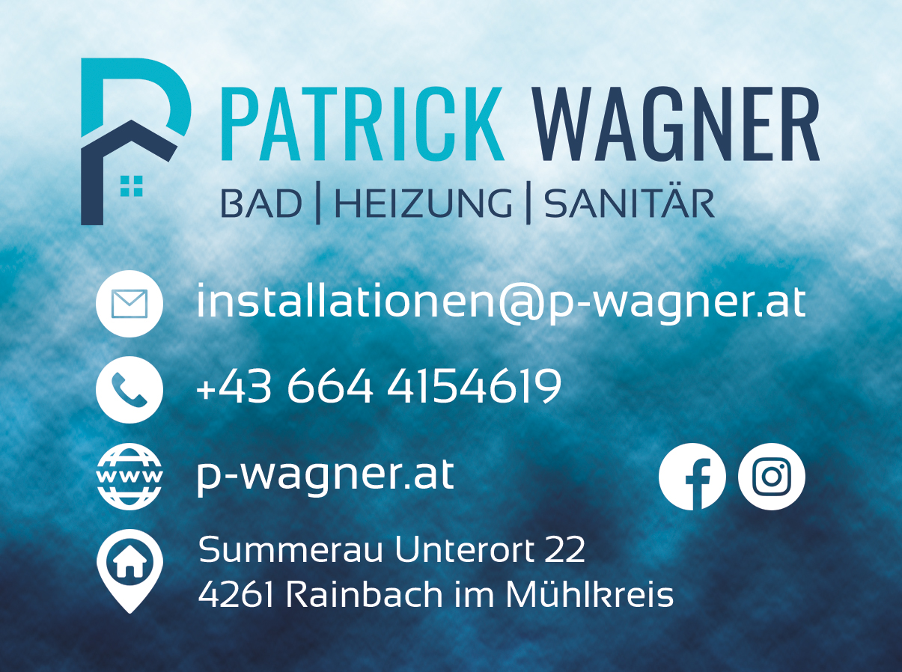

# **PipeTracker**

# **Planning**

I tried to structure my planning phase using the 5 UX planes - strategy, scope, structure, skeleton and surface. The planning process was iterative and while getting a better idea of the project´s scope and speaking to my customer about his needs for the application these planes changed creating a user-centered design for PipeTracker.

## **Strategy Plane**

My initial idea for this project was to create an application for my husband´s plumbing business. He is self-employed and I created his Logo, Designs and Website. So I wanted to make a real-world application where I could put this to use.

After talking to him about possible applications he might need that would be suitable for this project, the idea of an inventory tool - **PipeTracker** - quickly came to life.

### **Target Audience**

As this project is intended to be a specific real-world application for my husband, he and possible employees are my target audience or customers. But in general, a tool like this could be used for all plumbing companies so a few characteristics for my target audience would be the following.

- A plumbing company that wants to keep track of its inventory with an online application.
- Anybody who wants to manage stock items and have an overview of the current value they have in stock.
- A plumber who wants to easily create an invoice from the stock items used for a customer. 

## **Scope Plane**

To get a better understanding of what the application will look like I wrote down the features and sorted them into necessary and nice-to-have features.

**Necessary Features:**

- Plumber can log in to the application.
- Plumber can register to the application.
- Stock items can be added, updated and deleted.
- Stock items are linked to categories.
- Plumber has an overview of the current value (in €) that is in the inventory.

**Nice-to-have Features:**

- Create a delivery note - remove items from stock by adding them to a delivery note for a customer.
- Employees can log in but have another role with different permissions (for example they don´t see the price).
- Images can be uploaded for categories.
- Plumber can make a list of items to order that can be exported as a CSV/PDF file.
- Items can be added by scanning a QR code.
- Datanorm (file format for stock items used by plumbing wholesalers) can be imported and automatically update the price for stock items.

## **Structure Plane**

## **Skeleton Plane**

### **Wireframes**

I created wireframes for desktop, tablet and mobile for each of the main parts of the application.

    
<strong>Landing Page</strong>
  
    

    
<strong>Dashboard</strong>
  
    

    
<strong>Categories</strong>
  
    

    
<strong>Stock Items</strong>
  
    

    
<strong>Cart</strong>
  
    

    
<strong>Delivery notes</strong>
  
    

    
<strong>Add delivery note</strong>
  
    

    
<strong>Detail delivery note</strong>
  
    

### **Database Schema**

## **Surface Plane**

### **Design**

As mentioned above, I already created a [website](https://p-wagner.at/), as well as all the designs and logos for my husband´s company before starting this project. I will use the existing design for this project. As a reference, here is what the company´s business card I designed looks like.

I used shades of blue and the background representing water as it is fitting for a plumbing company. The logo is my husband´s name with the services he offers.

From this existing design, I created the color scheme for this project. I used [contrast-grid.eightshapes.com](https://contrast-grid.eightshapes.com/?version=1.1.0&background-colors=&foreground-colors=%23274060%0D%0A%2300B2CA%0D%0A%23041020%0D%0A%23f9f9f9&es-color-form__tile-size=regular&es-color-form__show-contrast=aaa&es-color-form__show-contrast=aa&es-color-form__show-contrast=aa18&es-color-form__show-contrast=dnp) to check the contrast and possible color combinations.

I will use the same fonts for this project as I used on the website. **Roboto** and **Montserrat** are both Google Fonts and fit well with the logo and design of the company.
