# **Testing**

[Go back to the README](README.md)

## **Table of Contents**

<!-- TOC -->
* [**Testing**](#testing)
  * [**Table of Contents**](#table-of-contents)
  * [**Manual Testing**](#manual-testing)
  * [**User Story Testing**](#user-story-testing)
    * [**Role-based restrictions**](#role-based-restrictions)
    * [**CSV Upload**](#csv-upload)
  * [**Accessibility Testing**](#accessibility-testing)
  * [**Lighthouse Testing**](#lighthouse-testing)
  * [**Validation**](#validation)
    * [**HTML Validation**](#html-validation)
    * [**CSS Validation**](#css-validation)
    * [**JavaScript Validation**](#javascript-validation)
    * [**Python Validation**](#python-validation)
  * [**Bugs and Fixes**](#bugs-and-fixes)
<!-- TOC -->

## **Manual Testing**

I started this project by setting everything up and deploying it right away. While developing new features, I tested them on the local version. After finishing and pushing features or parts of them, I tested them on the deployed project.

I always tested new input by entering incorrect information and trying to break it. This way I ensured correct error handling and feedback to the user.

I regularly tested the application in different browsers and devices, like my phone and tablet. When I found a bug while testing on my phone, I created a **Bug Issue** on my Kanban board and provided details and screenshots. After finishing all my *must have* user stories for the MVP, I did a first big round of testing.

The *#peer-code-review* channel on Code Institute´s Slack was used to get some feedback from other students. I also sent the link to my project to friends and family asking them to test it.

I tested to a minimum screen width of **300px** and a maximum screen width of **3440px** with my monitor. To test **Safari** and **iOS devices** I used [BrowserStack](https://www.browserstack.com/).

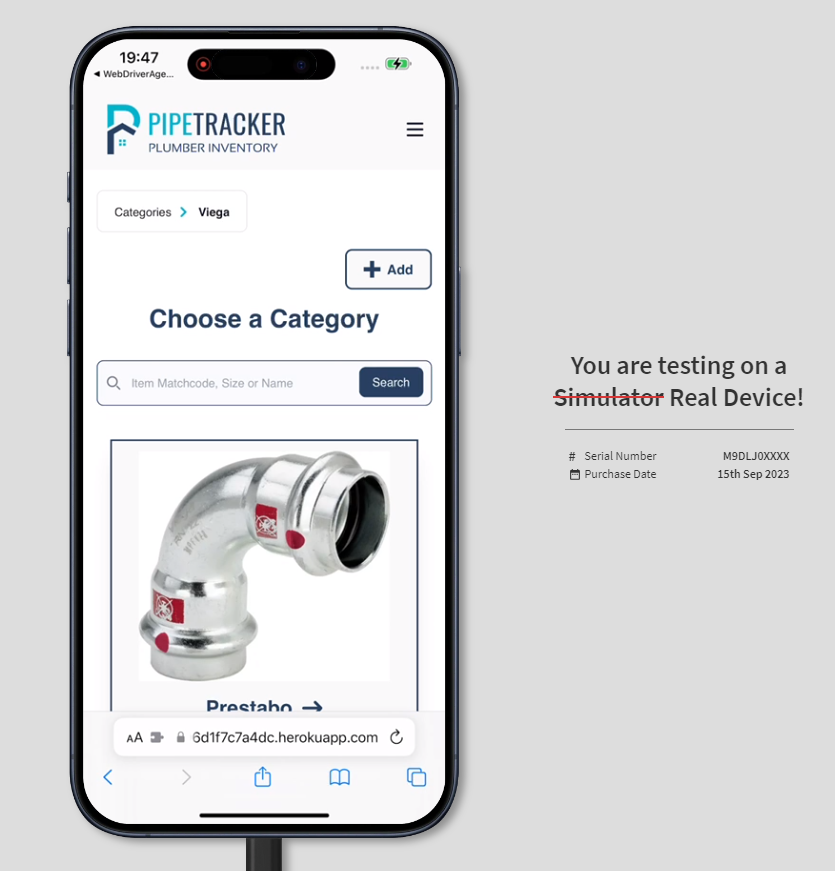\
*BrowserStack testing iPhone*

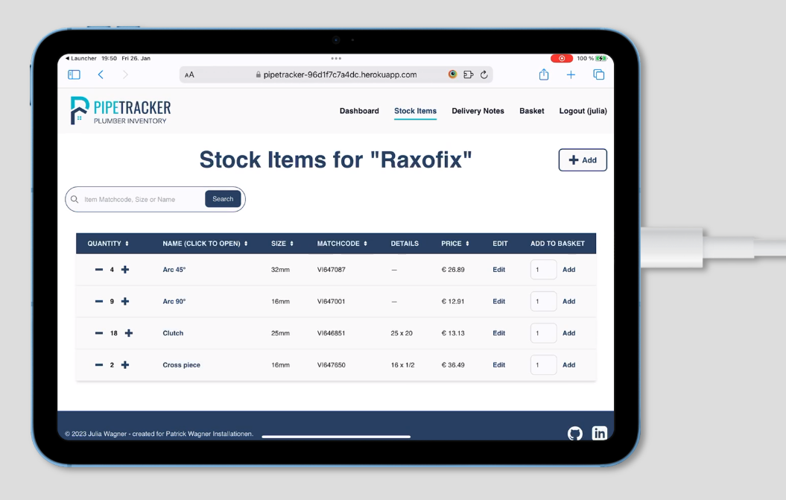\
*BrowserStack testing iPad*

## **User Story Testing**

| Testing setup                      | Passed all user story tests |
|------------------------------------|-----------------------------|
| Monitor (3440px screen width)      | &check;                     |
| Laptop (Google Chrome)             | &check;                     |
| Laptop (Mozilla Firefox)           | &check;                     |
| Laptop (Microsoft Edge)            | &check;                     |
| Laptop (Safari - via BrowserStack) | &check;                     |
| Tablet (Samsung)                   | &check;                     |
| iPad (via BrowserStack)            | &check;                     |
| Phone (Samsung Galaxy S23)         | &check;                     |
| iPhone (via BrowserStack)          | &check;                     |

In order for the **Acceptance Criteria met** to be ticked, every criterion specified in the linked project issue has to be fulfilled.

| User Story                                                                                                                                                            | Link to Acceptance Criteria                                   | Acceptance Criteria met                |
|-----------------------------------------------------------------------------------------------------------------------------------------------------------------------|---------------------------------------------------------------|----------------------------------------|
| As a **new user**, I want to **register to the application**, so that I can **manage my inventory**.                                                                  | [link](https://github.com/Julia-Wagner/PipeTracker/issues/1)  | &check;                                |
| As an **existing user**, I want to **log in to the application**, so that I can **access my inventory**.                                                              | [link](https://github.com/Julia-Wagner/PipeTracker/issues/2)  | &check;                                |
| As a **site owner**, I want to **manage user roles**, so that I can **choose who can access sensitive information**.                                                  | [link](https://github.com/Julia-Wagner/PipeTracker/issues/3)  | Feature not included for first release |
| As a **site user**, I want to **create and view categories**, so that I can **organize my inventory**.                                                                | [link](https://github.com/Julia-Wagner/PipeTracker/issues/4)  | &check;                                |
| As a **site user**, I want to **update categories**, so that I can **change the structure of my inventory**.                                                          | [link](https://github.com/Julia-Wagner/PipeTracker/issues/5)  | &check;                                |
| As a **site user**, I want to **delete categories**, so that I can **remove unnecessary categories**.                                                                 | [link](https://github.com/Julia-Wagner/PipeTracker/issues/6)  | &check;                                |
| As a **site user**, I want to **create and view stock items**, so that I can **organize my inventory**.                                                               | [link](https://github.com/Julia-Wagner/PipeTracker/issues/7)  | &check;                                |
| As a **site user**, I want to **update stock items**, so that I can **correctly maintain my inventory**.                                                              | [link](https://github.com/Julia-Wagner/PipeTracker/issues/8)  | &check;                                |
| As a **site user**, I want to **delete stock items**, so that I can **remove items from my inventory**.                                                               | [link](https://github.com/Julia-Wagner/PipeTracker/issues/9)  | &check;                                |
| As a **site user**, I want to **have a dashboard with statistics**, so that I can **make decisions for my business**.                                                 | [link](https://github.com/Julia-Wagner/PipeTracker/issues/10) | &check;                                |
| As a **site user**, I want to **create and view delivery notes**, so that I can **track where my stock items went**.                                                  | [link](https://github.com/Julia-Wagner/PipeTracker/issues/11) | &check;                                |
| As a **site user**, I want to **link customers to delivery notes**, so that I can **easily invoice the needed items for a customer**.                                 | [link](https://github.com/Julia-Wagner/PipeTracker/issues/12) | &check;                                |
| As a **site user**, I want to **update delivery notes**, so that I can **track if it was already invoiced**.                                                          | [link](https://github.com/Julia-Wagner/PipeTracker/issues/13) | &check;                                |
| As a **site user**, I want to **delete delivery notes**, so that I can **remove unnecessary delivery notes**.                                                         | [link](https://github.com/Julia-Wagner/PipeTracker/issues/14) | &check;                                |
| As a **site user**, I want to **add stock items to the cart**, so that I can **collect the items I need**.                                                            | [link](https://github.com/Julia-Wagner/PipeTracker/issues/15) | &check;                                |
| As a **site user**, I want to **view my cart**, so that I can **see my collected items**.                                                                             | [link](https://github.com/Julia-Wagner/PipeTracker/issues/16) | &check;                                |
| As a **site user**, I want to **update my cart**, so that I can **change the number of added stock items**.                                                           | [link](https://github.com/Julia-Wagner/PipeTracker/issues/17) | &check;                                |
| As a **site user**, I want to **transfer my cart to a delivery note**, so that I can **easily fill my delivery notes**.                                               | [link](https://github.com/Julia-Wagner/PipeTracker/issues/18) | &check;                                |
| As a **site user**, I want to **export a delivery note with its items**, so that I can **easily create an invoice for the customer**.                                 | [link](https://github.com/Julia-Wagner/PipeTracker/issues/19) | &check;                                |
| As a **site user**, I want to **update stock items by scanning a QR code**, so that I can **simplify the process of adding and removing items to/from my inventory**. | [link](https://github.com/Julia-Wagner/PipeTracker/issues/20) | &check;                                |
| As a **site user**, I want to **import CSV files**, so that I can **automatically create stock items**.                                                               | [link](https://github.com/Julia-Wagner/PipeTracker/issues/21) | &check;                                |

### **Role-based restrictions**

Apart from accessing the admin panel, I added more role-based restrictions to my application. I tested the restricted functionality as a superuser and as a normal user, to make sure the restrictions work as intended.

Only the superuser can delete categories, normal users don´t see the delete button and get an error message when trying to access the delete view.

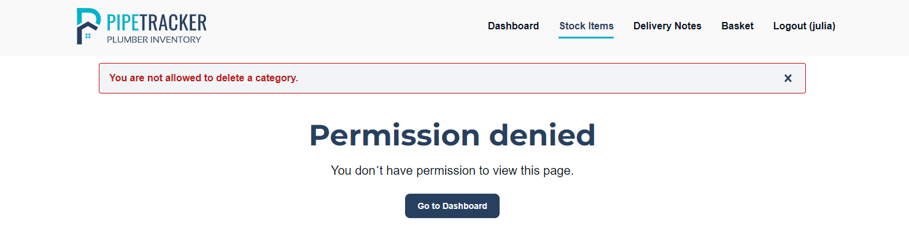\
*Permission denied delete category (normal user)*

Closed delivery notes can not be edited or deleted by normal users. The superuser however is allowed to perform these actions.

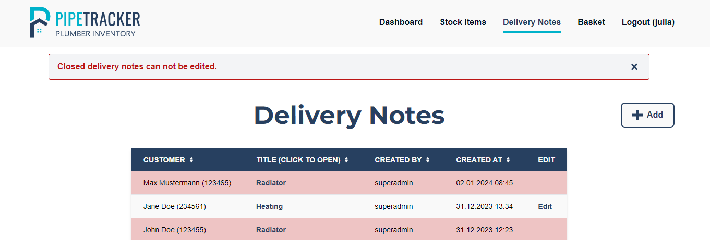\
*Edit a closed delivery note (normal user)*

### **CSV Upload**

The feature to upload a CSV file to automatically create stock items was extensively tested. I wanted to ensure that uploading an incorrect file or missing values could not break the application.

Here are the test cases with the according error/success messages:

**Successful upload with 18 stock items**
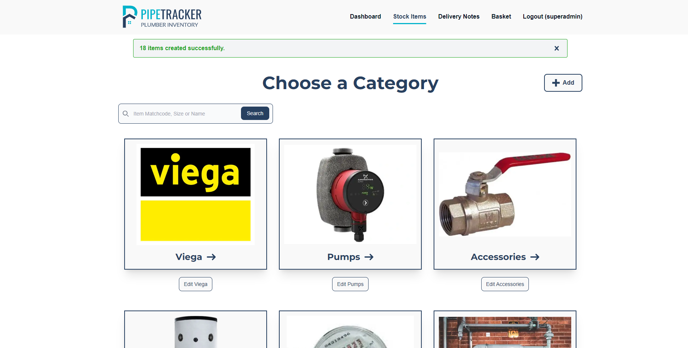

**Upload with an already existing item**
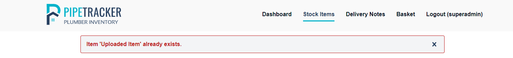

**Upload with missing data for required fields**

**Upload with an invalid category id**

**Upload with an invalid data type (quantity)**
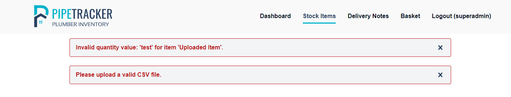

**Upload with an invalid data type (price)**
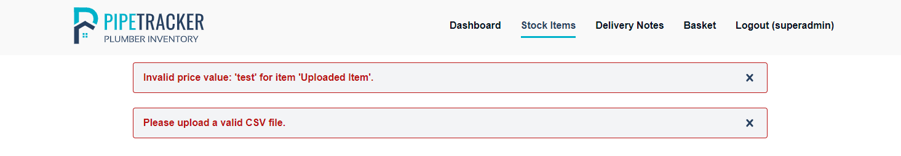

## **Accessibility Testing**

I tested my application using the [WAVE tool](https://wave.webaim.org/) to ensure good accessibility. It returned no errors for all pages of the application.

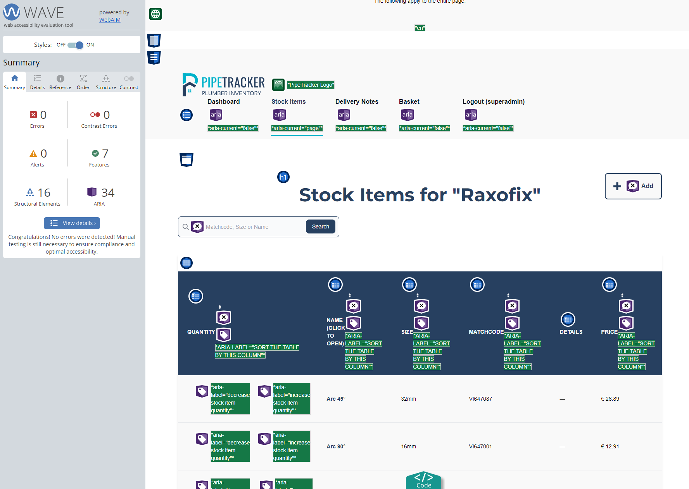\
*WAVE result for Stock Items*

## **Lighthouse Testing**

I ran Lighthouse for mobile and desktop regularly while developing new features. For the final testing, I ran it again on every page of the application. For *SEO* I got the error of a missing *robots.txt* file. So I added the file following [this article](https://adamj.eu/tech/2020/02/10/robots-txt/).

For all my pages on mobile and desktop tests, the score was **100** for *Best Practices* and *SEO*. For *Accessibility*, it was **100** for all pages except the category listings. There it was **96**, because of an issue with accessible names.

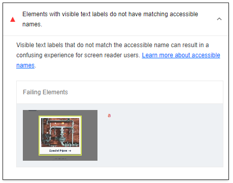\
*Accessible names issue in Lighthouse for categories*

I tried different approaches to fix this, but the issue was still there. The `<a>` element does have an `aria-label` and I tried restructuring the elements and adding descriptive text for screenreaders.

As I am unsure if this is really an issue or just a bug or misinterpretation of the Lighthouse tool, I decided to trust the WAVE accessibility tool which gave me no errors or warnings here and leave it like it is.

For *Performance*, my score is between **90** and **100** on all pages.

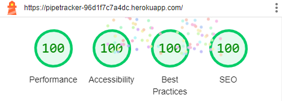\
*Lighthouse score index page (desktop)*

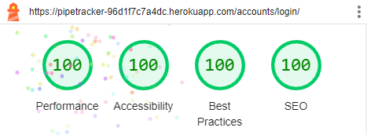\
*Lighthouse score login page (desktop)*

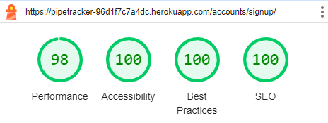\
*Lighthouse score register page (mobile)*

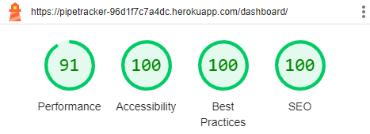\
*Lighthouse score dashboard (mobile)*

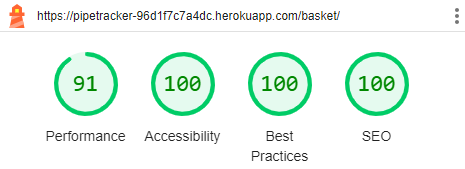\
*Lighthouse score basket (desktop)*

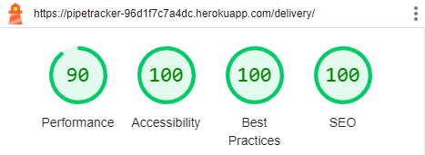\
*Lighthouse score delivery notes (mobile)*

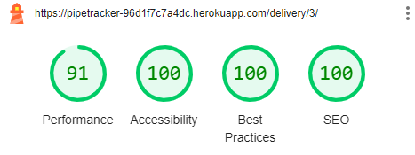\
*Lighthouse score delivery note detail (mobile)*

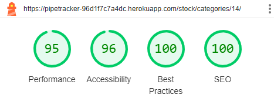\
*Lighthouse score category (mobile)*

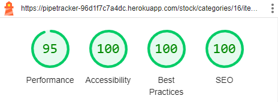\
*Lighthouse score stock items (desktop)*

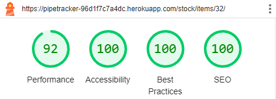\
*Lighthouse score stock item detail (desktop)*

## **Validation**

### **HTML Validation**

I used the [HTML W3C Validator](https://validator.w3.org/) to validate all of my HTML files. I validated each page of the application by right-clicking on the deployed page, selecting *View page source* and pasting the code to the validator.

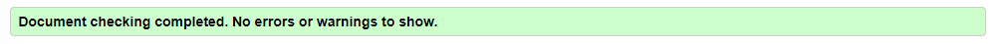\
*HTML validation result for all pages*

I did not get any warnings or errors, the full validation results can be found here:

- [Index page (logged out)](docs/testing/validation_index.pdf)
- [Registration](docs/testing/validation_register.pdf)
- [Login](docs/testing/validation_login.pdf)
- [Logout](docs/testing/validation_logout.pdf)
- [Dashboard](docs/testing/validation_dashboard.pdf)
- [Choose a category](docs/testing/validation_category.pdf)
- [Choose a subcategory (with breadcrumbs)](docs/testing/validation_subcategory.pdf)
- [Add a category](docs/testing/validation_add_category.pdf)
- [Edit a category](docs/testing/validation_edit_category.pdf)
- [Delete a category](docs/testing/validation_category_confirm_delete.pdf)
- [Stock items table](docs/testing/validation_items.pdf)
- [Stock items search results](docs/testing/validation_items_search.pdf)
- [Add a stock item](docs/testing/validation_add_item.pdf)
- [Edit a stock item](docs/testing/validation_edit_item.pdf)
- [Delete a stock item](docs/testing/validation_item_confirm_delete.pdf)
- [Stock item detail](docs/testing/validation_item_detail.pdf)
- [CSV file upload](docs/testing/validation_upload.pdf)
- [Basket](docs/testing/validation_basket.pdf)
- [Delivery notes](docs/testing/validation_delivery_notes.pdf)
- [Add a delivery note](docs/testing/validation_add_note.pdf)
- [Edit a delivery note](docs/testing/validation_edit_note.pdf)
- [Delete a delivery note](docs/testing/validation_note_confirm_delete.pdf)
- [Delivery note detail](docs/testing/validation_note_detail.pdf)
- [Add a customer](docs/testing/validation_add_customer.pdf)

### **CSS Validation**

I used the [W3C CSS Validator](https://jigsaw.w3.org/css-validator/) to validate my custom CSS code, the CSS created by Tailwind was not tested. My custom CSS code was validated without errors.

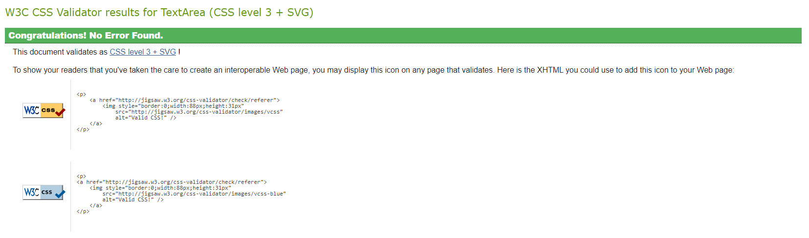\
*CSS validation result for custom CSS*

### **JavaScript Validation**

[JSHint](https://jshint.com/) was used to test my JavaScript code. Warnings that occur because of the use of ES6 variables can be resolved by adding `/* jshint esversion: 6 */` as a comment in the first line of JSHint. `/*globals $:false */` can be added to avoid warnings because of the use of *jQuery*.

My project has a **base.js** file containing JavaScript code that is needed on every page. JavaScript code which is only needed for certain pages, was included in the necessary templates directly. No errors or warnings were found for my JavaScript code.

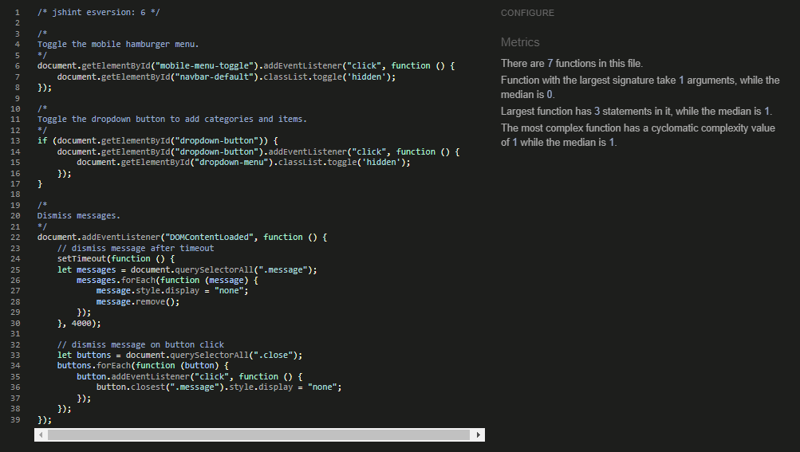\
*JS validation result for base.js*

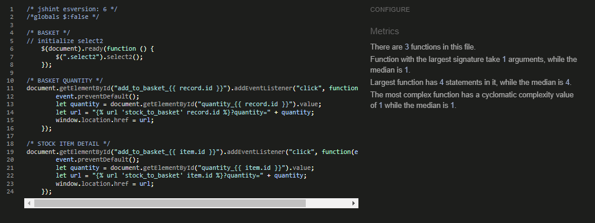\
*JS validation result for template files*

### **Python Validation**

To ensure that my code follows Pep8 style guidelines, I installed [Flake8](https://flake8.pycqa.org/en/latest/). I ran the linter on my whole project, only excluding the *venv* directory to avoid errors from external packages. There were only a few errors that remained after fixing all my line lengths and removing unused imports. The first five errors come from Django files that I never changed, so I decided not to change them for the linter. 

The only error coming from a file that I changed was **F401 'env' imported but unused** from the *settings.py* file. Because I added this code following the Code Institute walkthrough projects, I decided to leave the statement as is. I also tried to remove the unused import, but then the application fails to run locally. So it seems the import is actually not unused and the error might be a misinterpretation from Flake8.

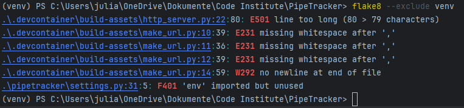\
*Flake8 validation result*

## **Bugs and Fixes**

When testing the application on my phone, or when I encountered bugs outside the current sprints' scope, I opened a **Bug issue** on my Kanban board.

Besides the adaptions and fixes already mentioned in the documentation, here are the Bugs I found. There are no known bugs that are not solved.

| Bug                                                                                                 | Solved  | Bug Issue                                                                                    | Fix Commit                                                                                             | Solution                                                                                                                                             |
|-----------------------------------------------------------------------------------------------------|---------|----------------------------------------------------------------------------------------------|--------------------------------------------------------------------------------------------------------|------------------------------------------------------------------------------------------------------------------------------------------------------|
| The logo changed when opening the application on the phone.                                         | &check; | [Bug #1: Mobile adjustments](https://github.com/Julia-Wagner/PipeTracker/issues/25)          | [6731d70](https://github.com/Julia-Wagner/PipeTracker/commit/6731d70a1c27284d7d4c812f98e39742d862f4c6) | The logo is an SVG file and did not appear correctly on devices without the fonts installed, so I converted the font to outline when saving the SVG. |
| The mobile view for the stock items table was missing the **Add to basket** button.                 | &check; | [Bug #2: Add to basket mobile](https://github.com/Julia-Wagner/PipeTracker/issues/26)        | [330dbfa](https://github.com/Julia-Wagner/PipeTracker/commit/330dbfa64da9e4bc2cd310a3c1f179b481949322) | As the mobile version for the tables caused several problems, I decided to use a responsive table instead.                                           |
| The mobile view for the delivery notes table did not visually differentiate a closed delivery note. | &check; | [Bug #3: Closed delivery note mobile](https://github.com/Julia-Wagner/PipeTracker/issues/27) | [330dbfa](https://github.com/Julia-Wagner/PipeTracker/commit/330dbfa64da9e4bc2cd310a3c1f179b481949322) | As the mobile version for the tables caused several problems, I decided to use a responsive table instead.                                           |
| Error/Success messages were too small on mobile screens.                                            | &check; | [Bug #4: Mobile messages](https://github.com/Julia-Wagner/PipeTracker/issues/28)             | [3d67578](https://github.com/Julia-Wagner/PipeTracker/commit/3d67578feb20960155ba7adfe5a733608949111a) | I changed the messages to be full width for small screen sizes.                                                                                      |
| A server error was caused when decreasing the quantity of a delivery item.                          | &check; | [Bug #5: 500 Error](https://github.com/Julia-Wagner/PipeTracker/issues/29)                   | [4da7a86](https://github.com/Julia-Wagner/PipeTracker/commit/4da7a86ecb72305ad5114ed9e22f5a7207f88e4e) | An incorrect primary key was used for the redirect.                                                                                                  |
| When reducing the quantity of basket items, the quantity could be less than 0.                      | &check; | [Bug #6: Basket quantity](https://github.com/Julia-Wagner/PipeTracker/issues/36)             | [d66e8e3](https://github.com/Julia-Wagner/PipeTracker/commit/d66e8e3f5935603fb61155c13099bfb94e3112a7) | I adapted the view to remove the item from the basket if the quantity is decreased to be less than 1.                                                |

